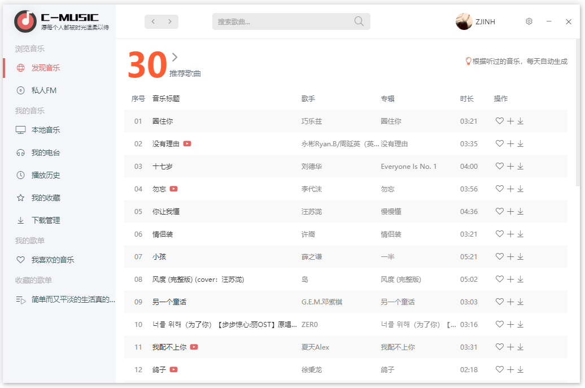
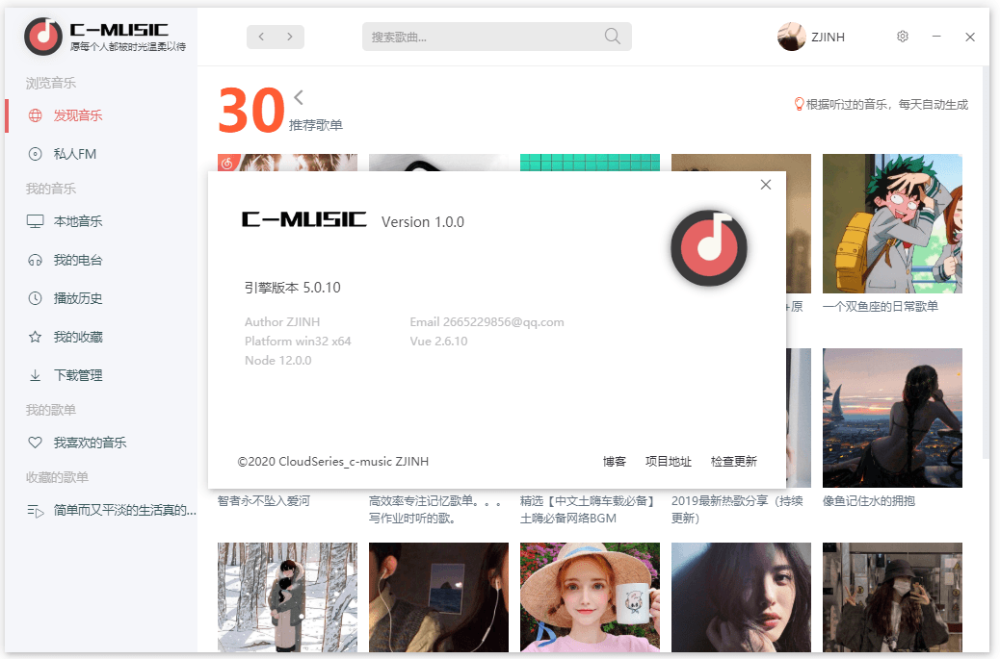
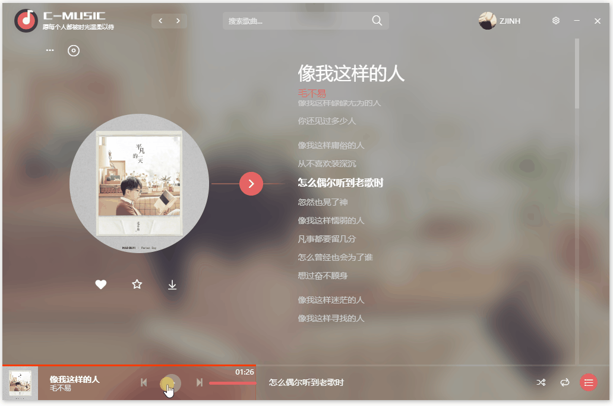
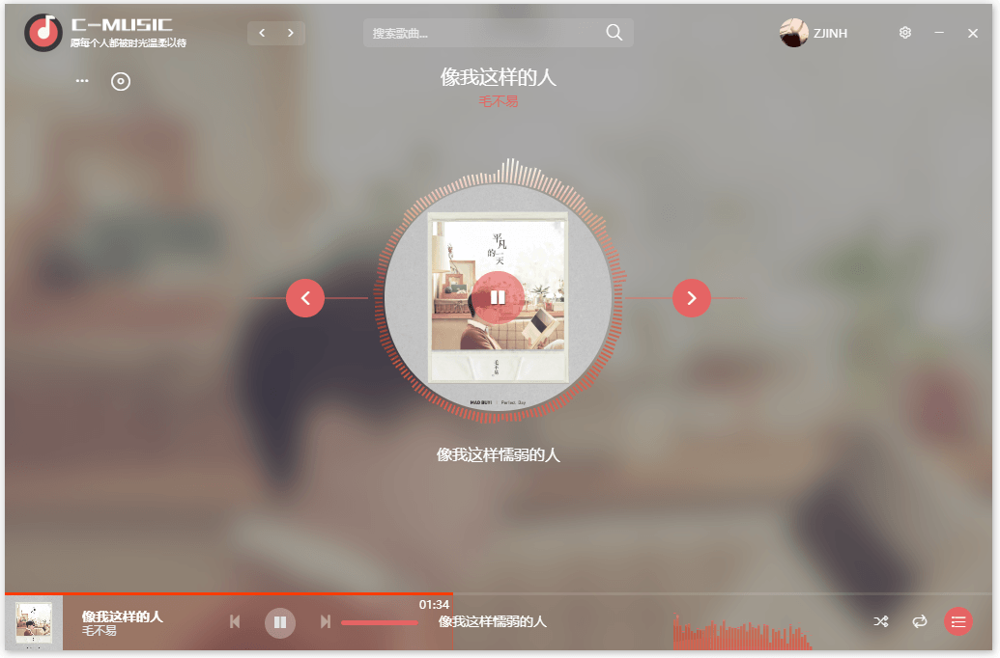
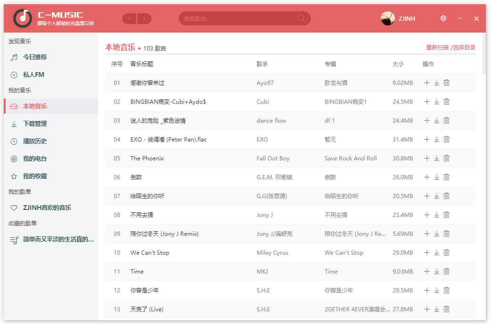
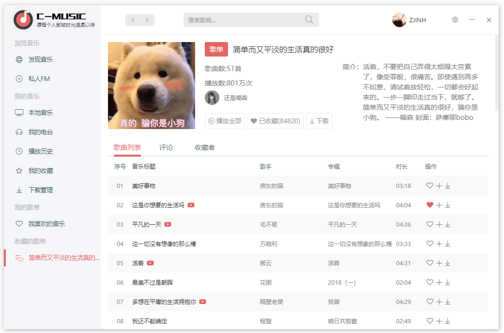

# CloudMusic(C-Music)

> C-Music
## 体验
- [点我下载](https://works.zjinh.cn/CloudMusic)
（使用网易账户登录，不放心的请下载源码参照下面方法修改服务地址体验）
## Cloud系列项目
- [CloudDisk](https://github.com/zjinh/CloudDisk)
- [CloudWeather](https://github.com/zjinh/CloudWeather)
- [Cloud-Web](https://cloud.zjinh.cn/)
## 基础框架
- [electron-vue-cli3](https://github.com/zjinh/electron-vue-cli3)
## 个人博客
- [Blog](https://blog.zjinh.cn/)
## 🖥 应用界面
#### 主界面
   
   
#### 展开的播放页
   
#### 简约的播放页
   
#### 桌面歌词
   
#### 歌单
   
   
  
---
## 头脑第二次发热开发的音乐小应用

C-Music是一款简洁的音乐播放器。

## ✨ 功能亮点
- 🕹 简洁的图形操作界面
- 💾 支持断点下载歌曲/MV（未完成）
- 🔔 传输任务完成通知提醒
- ✨ 每日歌曲/歌单推荐
- ✨ MV在线播放（未完全完成）
- ✨ 音乐在线搜索
- ✨ 本地音乐播放
- ✨ 本地音乐匹配歌词、封面
- ✨ 桌面歌词

## 🛠 使用的技术栈
- [Electron](https://electronjs.org/)
- [electron-vue](https://simulatedgreg.gitbooks.io/electron-vue/content/cn/) 
- [electron-builder](https://www.electron.build/) 
- [Vue](https://vuejs.org/)
- [VueX](https://vuex.vuejs.org/)
- [iView](https://www.iviewui.com/)
- [Element](https://element.eleme.io)

## :star2: 数据接口
- [NeteaseCloudMusicApi](https://github.com/Binaryify/NeteaseCloudMusicApi)

### 部分功能未开发完成

## ⌨️ 本地开发

### 克隆代码
```bash
git clone --depth=1 https://github.com/zjinh/CloudMusic.git
```

### 安装依赖
```bash
cd CloudMusic
npm i
```
### 淘宝的npm源
```bash
npm config set registry 'https://registry.npm.taobao.org'
npm config set ELECTRON_MIRROR='https://npm.taobao.org/mirrors/electron/'
```
或者使用[Yarn](https://yarnpkg.com/)安装依赖

### 修改服务器地址
```bash
前往CloudMusic\src\tools\api\request.js
修改severAddress中的return值
可修改为自己部署的 NeteaseCloudMusicApi 地址
```

### 运行项目
```bash
npm run dev
```
### 打包项目
```bash
npm run build

